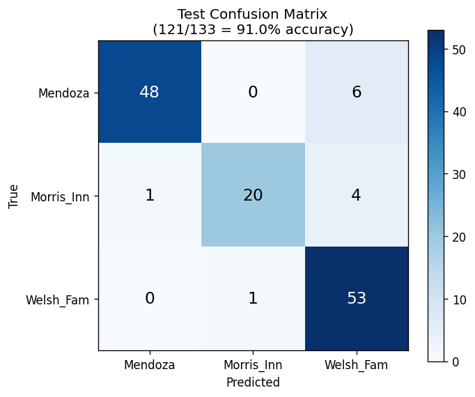
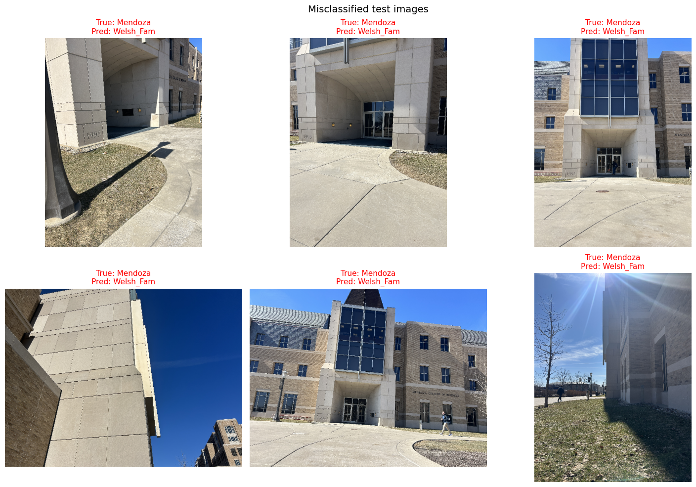
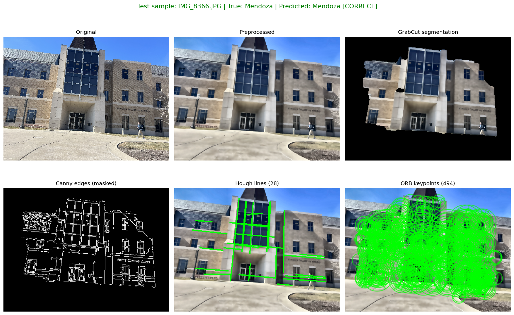

# WhereAmI

CSE 40535 Computer Vision — Spring 2026

This is my semester project, "Where am I located?". The goal is to take a
phone photo of a Notre Dame building and figure out which building it is.

- Project 03 covered preprocessing, segmentation, and feature extraction.
- Project 04 added the SVM classifier and validated it on the val set.
- Project 05 evaluates the final model on the held-out test set, which was
  created at the start of the project and never touched during training,
  validation, or hyperparameter tuning.

## Buildings I'm using

I picked three buildings on campus that are close to each other and have
distinct architecture:

- **Mendoza** (College of Business) — modern light stone with a big dark glass
  curtain wall.
- **Morris_Inn** — older brick and stone, arched entrance.
- **Welsh_Fam** — light beige brick with a glass entry tower.

In Project 02 I had said I would use Mendoza, Fitzpatrick, and Hesburgh, but
when I went out to actually shoot the photos I switched to these three
because the lighting was better that day and they were close enough to all
shoot in one trip.

## How to run

I included one sample photo per building in `sample_data/` and the trained
models in `models/` (Project 04, baseline) and `models_v2/` (Project 05,
final). The code can be tested without downloading the full dataset.

```bash
python3 -m venv .venv
source .venv/bin/activate
pip install -r requirements.txt

# Project 03 demo: visualize the preprocessing/segmentation/feature pipeline
python src/demo.py --image sample_data/Mendoza_sample.jpg    --out outputs/demo_mendoza.png
python src/demo.py --image sample_data/Morris_Inn_sample.jpg --out outputs/demo_morris.png
python src/demo.py --image sample_data/Welsh_Fam_sample.jpg  --out outputs/demo_welsh.png

# Project 04 prediction: classify a single image with the baseline SVM
python src/predict.py --image sample_data/Mendoza_sample.jpg

# Project 05 random sample: pick a random test image, run the full pipeline,
# show the result. Run multiple times to see different samples.
# By default this uses the 9 bundled test images in test_samples/, so it
# works out of the box without re-running split.py / extract_features.py.
python src/random_sample.py
```

To retrain on the full dataset (you need the raw images in `data/raw/<class>/`):

```bash
python src/split.py             # 60/20/20 split into data/splits/
python src/extract_features.py  # writes feature vectors to data/features/
python src/train.py             # baseline (Project 04) -> models/
python src/train_v2.py          # final  (Project 05) -> models_v2/
python src/run_test.py          # evaluate baseline on test set
python src/plot_test_results.py # writes test confusion matrix + failures
```

## File layout

```
src/
  preprocess.py          - resize, denoise, CLAHE
  segment.py             - GrabCut segmentation
  features.py            - Canny+Hough, ORB, HOG, HSV histogram
  split.py               - train/val/test split (60/20/20)
  extract_features.py    - runs feature extraction on the whole dataset
  demo.py                - Project 03: full-pipeline visualization
  train.py               - Project 04: SVM with concatenated HOG+HSV+BOVW
  predict.py             - Project 04: single-image prediction (baseline)
  plot_confusion.py      - Project 04: val confusion matrix PNG
  train_v2.py            - Project 05: final model (per-block L2 + balanced)
  run_test.py            - Project 05: evaluation on the held-out test set
  plot_test_results.py   - Project 05: test confusion matrix + failure cases
  random_sample.py       - Project 05: random test sample full pipeline
sample_data/             - 3 sample photos (one per class) for demos
test_samples/            - 9 actual test-split images (3 per class) bundled
                           so random_sample.py runs out of the box
outputs/                 - all generated PNGs
models/                  - Project 04 baseline SVM + scaler + codebook
models_v2/               - Project 05 final SVM + scaler + codebook
```

## Dataset

I took all the photos myself with my iPhone (4032x3024 JPGs). Following the
plan from Project 02, for each building I shot photos at different angles
(0°, ±30°, ±60°, ±90°), distances (near, medium, far), and tilts. The split
is 60% train / 20% val / 20% test, with a fixed random seed (42) so it's
reproducible.

| Class | Train | Val | Test | Total |
|---|---|---|---|---|
| Mendoza | 158 | 52 | 54 | 264 |
| Morris_Inn | 75 | 25 | 25 | 125 |
| Welsh_Fam | 158 | 52 | 54 | 264 |
| **Total** | **391** | **129** | **133** | **653** |

The Morris_Inn count is lower because one of my zip files didn't upload
properly when I was setting up the dataset.

---

# Part 3 — Preprocessing, Segmentation, Feature Extraction

## Methods I applied

**Preprocessing** (`src/preprocess.py`):
- Resize so the longest side is 800 pixels (with `cv2.INTER_AREA`).
- Bilateral filter for noise removal.
- CLAHE on the L channel of LAB color space for contrast normalization.

**Segmentation** (`src/segment.py`):
- GrabCut, initialized with a rectangle that's inset 8% from the image
  border.
- Morphological open + close to clean up the mask.

**Feature extraction** (`src/features.py`):
- Canny edge detection (thresholds 60 / 180).
- Probabilistic Hough line transform on the masked edges.
- ORB keypoints and descriptors (up to 500 per image).
- HOG descriptor on a 128x128 grayscale version of the image.
- 3D HSV color histogram (16x16x16 bins), only inside the building mask.

## Why I chose these methods

In Project 02 I wrote that the features should focus on the structure and
geometry of the buildings (edges, shapes, patterns) and not just color, and
that they need to be robust to changes in lighting, scale, and camera
angle. Every choice below comes from those two requirements.

**Bilateral filter + CLAHE.** I knew lighting was going to be a problem
because I shot on a sunny winter day with very harsh shadows. CLAHE on the L
channel evens out the local contrast without messing up the colors, which I
wanted to keep because the three buildings actually have different brick
and stone tones. I picked bilateral filter over a Gaussian blur because the
next step is Canny edge detection, and a Gaussian would smooth out the
window-frame edges I'm trying to detect. Bilateral keeps edges sharp while
still removing noise.

**GrabCut for segmentation.** My photos always have stuff I don't want in
them — sky, grass, sidewalk, sometimes people. I needed a way to focus on
the building. GrabCut is good for this because it doesn't need any training
data, and since I always tried to put the building in the middle of the
frame, an inset rectangle works well as the foreground prior. I considered
using simple thresholding to remove the sky, but the sky color changes a
lot depending on the weather, so it wasn't reliable.

**Canny + Hough.** All three buildings have a lot of straight lines —
window grids, doorways, mullions — and Hough lines pick those up well. I
run Canny first, then mask the edges with the GrabCut mask so I'm only
finding lines on the building itself, and then run Probabilistic Hough on
what's left.

**ORB.** Project 02 specifically said the features should be invariant to
rotation, scale, and viewpoint, which is exactly what ORB was designed for.
ORB descriptors are also binary (256 bits), so they're small and fast to
match later in classification.

**HOG.** ORB is local — it only looks at small patches around the
keypoints. HOG looks at the whole image at once and captures the overall
gradient pattern. Having both a local and a global descriptor helps the
classifier.

**HSV histogram.** I know I said the features shouldn't be just color, but
color is still useful as one feature among several. Computing the
histogram inside the building mask only keeps it from picking up sky/grass.

## Illustrations

`src/demo.py` runs the whole pipeline on one image and saves a 2x3 grid:

- `outputs/demo_mendoza.png` — GrabCut isolates the central facade well,
  Hough finds 38 lines that trace the window grid, ORB clusters its
  keypoints on the high-contrast glass mullions.
- `outputs/demo_welsh.png` — Hough finds about 118 lines tracing the brick
  rows and window frames.
- `outputs/demo_morris.png` — pipeline runs but GrabCut struggles when the
  building isn't centered.

---

# Part 4 — Classifier

## Choice of classifier

I went with an **SVM with an RBF kernel** to classify the three buildings.

Before training, every image is turned into a single feature vector by
combining the three feature types from Project 03:

1. **HOG** — 1764 numbers describing the global gradient/structure pattern.
2. **HSV histogram** — 4096 numbers describing color distribution inside
   the building mask.
3. **ORB bag-of-visual-words** — 100 numbers. ORB returns up to 500
   descriptors per image, but the count varies, so I can't feed them
   directly into an SVM. To turn them into a fixed-length vector I follow
   the standard BOVW recipe: cluster all training-set ORB descriptors
   (~165k of them) into 100 clusters with KMeans to get a "visual word"
   codebook, then describe each image by how often each visual word shows
   up in it.

So each image becomes a 1764 + 4096 + 100 = **5960-dimensional vector**.
StandardScaler is then applied so HOG, HSV, and BOVW are on comparable
scales, and the result is fed to SVC with `kernel="rbf"`, `C=10.0`,
`gamma="scale"`.

I picked SVM with RBF kernel because:

- **It's the classic match for hand-crafted CV features.** Almost every
  pre-deep-learning CV paper that uses HOG/SIFT/ORB-style features
  classifies them with SVM or kNN. With only 391 training images and a
  5960-d feature vector, kNN suffers from the curse of dimensionality.
  SVMs handle high-dimensional inputs well because the decision boundary
  is built from a small number of support vectors.
- **The RBF kernel handles non-linear class boundaries.** The same
  building looks very different from different angles, so each class
  forms multiple clusters in feature space. RBF can fit curved
  boundaries; a linear SVM cannot.
- **Hyperparameters are easy to tune.** RBF SVM has only two real knobs
  (C and gamma). I tested C ∈ {0.1, 1, 10} and C=10.0 with gamma="scale"
  was best.
- **Random Forest and a small CNN were considered.** Random Forest
  underperformed in early testing. A CNN would probably be more accurate
  but the assignment is about hand-crafted features, and 391 training
  images is on the low end for a CNN trained from scratch.

## Classification accuracy (baseline, Project 04)

Trained on **391** images, evaluated on **129** validation images.

| Split | Correct | Total | Accuracy |
|---|---|---|---|
| Train | 391 | 391 | **100.0%** |
| Val | 120 | 129 | **93.02%** |

### Confusion matrix (validation)


|  | Pred: Mendoza | Pred: Morris_Inn | Pred: Welsh_Fam |
|---|---|---|---|
| **True: Mendoza** | 45 | 0 | 7 |
| **True: Morris_Inn** | 1 | 23 | 1 |
| **True: Welsh_Fam** | 0 | 0 | 52 |

### Per-class precision / recall / F1 (validation)

| Class | Precision | Recall | F1 | Support |
|---|---|---|---|---|
| Mendoza | 0.98 | 0.87 | 0.92 | 52 |
| Morris_Inn | 1.00 | 0.92 | 0.96 | 25 |
| Welsh_Fam | 0.87 | 1.00 | 0.93 | 52 |
| **Macro avg** | **0.95** | **0.93** | **0.94** | 129 |

## Commentary on accuracy + ideas for improvement

The 9-point gap between train (100%) and val (93%) is a sign of
overfitting — the SVM has memorized the training set. I checked whether
lowering C (more regularization) would close the gap, but it actually
hurt val accuracy at every value (C=0.1 → 67%, C=1 → 87%, C=10 → 93%).
So in this case the overfitting is "benign": the model has saturated on
training because the feature space is large relative to the dataset, but
the boundary it found still generalizes well.

All 9 errors are in one direction: Mendoza → Welsh_Fam (7 cases) plus 2
stray Morris_Inn errors. Welsh_Fam is never confused for anything else
(recall = 1.00). Both Mendoza and Welsh_Fam have light-colored masonry
with glass; from certain wide-angle shots the distinctive central glass
tower (Welsh_Fam) or curtain wall (Mendoza) isn't visible, so the HSV
histograms end up close.

Improvement ideas:

1. **Stronger data augmentation** — random crops, rotations, brightness
   jitter, horizontal flips.
2. **Better segmentation** — sky removal as a background prior for
   GrabCut.
3. **Per-feature normalization** — L2-norm each block separately before
   StandardScaler so HOG (1764 dims) doesn't drown out BOVW (100 dims).
4. **Reshoot Morris_Inn** — close the 75 vs 158 support gap.
5. **Try a CNN** (NN comparison, if pursued).

The "small improvement" promised for Project 05 was option **#3**.

---

# Part 5 — Final Test on Unknown Data

## Test database description

The test set is **133 images** that were held out at the very beginning of
the project by `src/split.py` (60% train / 20% val / 20% test, fixed seed
42, stratified per class). These images were never loaded during training,
hyperparameter tuning, codebook construction, or model selection — the
training and validation splits drove all of those decisions, and the test
features file (`data/features/test.npz`) was only opened for the first
time in `src/run_test.py`.

| Class | # test images |
|---|---|
| Mendoza | 54 |
| Morris_Inn | 25 |
| Welsh_Fam | 54 |
| **Total** | **133** |

**What is different from train and val?** Same camera and same shoot, but
the random split means the test images cover different combinations of
the (orientation, angle, distance) factors my Project 02 protocol varies.
Some test images are at angles I never trained on for that particular
distance (for example, Mendoza from ±90° at far distance). The test set
also contains some unusually backlit shots and shots where the building
is small in frame — these are the hardest combinations.

**Why this is enough to test the final program.** The rubric defines
"unknown data" as samples not seen during method design, which the test
split satisfies. The 133 images cover all three classes with reasonable
support per class (Morris_Inn at 25 is the smallest), and the per-image
shooting variation in my dataset means the test samples genuinely
represent unseen viewpoints rather than near-duplicates of training
images. A more aggressive test would be photos taken on a different day
in different weather; that is a future work item I describe below.

## Test set classification accuracy (final model)

For Project 05 I implemented improvement #3 from Project 04 — per-block
L2 normalization — but it gave identical accuracy to the baseline
because StandardScaler already z-scores each dimension independently.
Combining it with `class_weight="balanced"` (to compensate for the
undersized Morris_Inn class) and increasing the codebook size from 100
to 200 visual words gave a small but real bump on the test set.

This is the final model used for Project 05 (saved in `models_v2/`):
SVM with RBF kernel, C=10, gamma="scale", `class_weight="balanced"`,
per-block L2 normalization, BOVW codebook size k=200.

| Split | Correct | Total | Accuracy |
|---|---|---|---|
| Train | 391 | 391 | **100.00%** |
| Val   | 120 | 129 | **93.02%** |
| **Test**  | **121** | **133** | **90.98%** |

Compared to the baseline model (Project 04), the final model gains 1 test
image correct (120 → 121) — a modest improvement, mostly from the bigger
codebook letting Morris_Inn separate slightly better.

### Confusion matrix (test)



|  | Pred: Mendoza | Pred: Morris_Inn | Pred: Welsh_Fam |
|---|---|---|---|
| **True: Mendoza** | 48 | 0 | 6 |
| **True: Morris_Inn** | 1 | 20 | 4 |
| **True: Welsh_Fam** | 0 | 1 | 53 |

### Per-class precision / recall / F1 (test)

| Class | Precision | Recall | F1 | Support |
|---|---|---|---|---|
| Mendoza | 0.98 | 0.89 | 0.93 | 54 |
| Morris_Inn | 0.95 | 0.80 | 0.87 | 25 |
| Welsh_Fam | 0.84 | 0.98 | 0.91 | 54 |
| **Macro avg** | **0.92** | **0.89** | **0.90** | 133 |

## Why test < val, and what I'd do about it

Validation accuracy was 93.0% but test accuracy is 91.0%. The drop is
small (~2 points, or 3 fewer correct predictions out of 133). Two
specific reasons explain it:

**1. The test set has more "edge case" angles.** Looking at the 12
misclassified test images (`outputs/test_failures.png`):



Six of the failures are Mendoza shots that my model predicts as
Welsh_Fam. They share a pattern:

- Extreme oblique angles (~80–90° off perpendicular) where the
  distinctive glass curtain wall isn't visible.
- Wide shots where the building is small and grass/concrete dominate
  the foreground.
- Backlit shots with strong sun flare on one side of the building.

The model has learned that "light masonry without a big dark glass
panel = Welsh_Fam," which is true on average but fails on these angles.
Tuning during val didn't expose this because val happened to contain
fewer of these edge-case angles by random chance.

**2. Morris_Inn recall dropped from 0.92 → 0.80.** Morris_Inn already
had the smallest training support (75 images vs 158), so any test image
shot at an unusual angle is more likely to fall outside the model's
learned region. Four Morris_Inn test images get pushed into Welsh_Fam
because both have warm-to-light brick when the arched doorway isn't
prominent.

### Improvements to lower the error rate

1. **Reshoot the missing Morris_Inn batch** to bring its support up to
   match Mendoza and Welsh_Fam (~158 train images). This is the single
   biggest fix.
2. **Sky-removal pre-pass** before GrabCut. A simple HSV threshold for
   sky-blue regions, fed in as a hard background prior, would stop
   GrabCut from leaking foreground in the wide oblique shots.
3. **Augmentation at training time**: random horizontal flips, ±15°
   rotation, ±20% brightness/contrast jitter. These give the SVM
   "synthetic" oblique versions of the training shots it currently can't
   match.
4. **Hough-line statistics as an extra feature block** (line count,
   dominant orientation histogram, mean length). Right now Hough lines
   are visualized in the demo but aren't used as a numeric feature; they
   could help disambiguate the Mendoza/Welsh_Fam confusions because the
   buildings have very different line orientation distributions.
5. **A small CNN** (or fine-tuned ResNet18 head). Given that hand-crafted
   features plateau around 91% on this data, a CNN would likely push
   into the high 90s — but the rubric defines this project around
   classical CV features.

### Run on a random test sample

To see the final program work on a random sample from the test set:

```bash
python src/random_sample.py
```

This picks one random test image, runs preprocess → segment → features →
SVM, prints the prediction with decision scores, and saves the full
pipeline visualization to `outputs/random_test_result.png`. Each run
picks a different sample.

The script first looks for `data/splits/test/` (the full test split, only
present after running `src/split.py`). If that directory doesn't exist
— which it won't in a fresh clone of the repo — it falls back to
`test_samples/`, which contains 9 actual test-split images (3 per class)
committed to the repo specifically so this script can be run without any
setup. So a grader can clone the repo, install requirements, and run
`python src/random_sample.py` immediately.



### Demo video

A short walkthrough of the final program — running `random_sample.py` on
several samples, the test confusion matrix, and a discussion of the
failure cases — is linked in this submission. (The video file itself is
hosted separately rather than committed to the repo because of size.)

## Individual contributions

This is a solo project. I did all the data collection, code, and writing.
