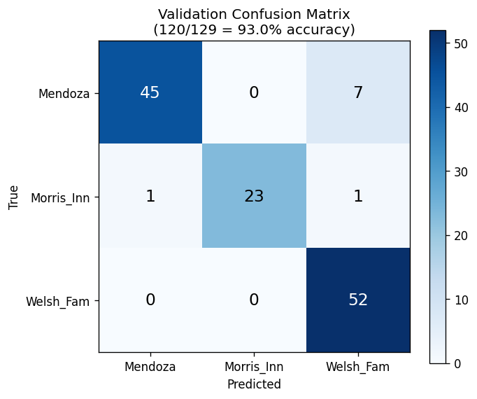

# WhereAmI

CSE 40535 Computer Vision — Spring 2026

This is my semester project, "Where am I located?". The goal is to take a
phone photo of a Notre Dame building and figure out which building it is.
Project 03 covered preprocessing, segmentation, and feature extraction.
Project 04 adds the classifier.

## Buildings I'm using

I picked three buildings on campus that are close to each other and have
distinct architecture:

- **Mendoza** (College of Business) — modern light stone with a big dark glass
  curtain wall.
- **Morris_Inn** — older brick and stone, arched entrance.
- **Welsh_Fam** — light beige brick with a glass entry tower.

In Project 02 I had said I would use Mendoza, Fitzpatrick, and Hesburgh, but
when I went out to actually shoot the photos I switched to these three
because the lighting was better that day and they were close enough to all
shoot in one trip.

## How to run on the sample images

I included one sample photo per building in `sample_data/` so the code can be
tested without downloading the full dataset.

```bash
python3 -m venv .venv
source .venv/bin/activate
pip install -r requirements.txt

# Project 03 demo: visualize the preprocessing/segmentation/feature pipeline
python src/demo.py --image sample_data/Mendoza_sample.jpg    --out outputs/demo_mendoza.png
python src/demo.py --image sample_data/Morris_Inn_sample.jpg --out outputs/demo_morris.png
python src/demo.py --image sample_data/Welsh_Fam_sample.jpg  --out outputs/demo_welsh.png

# Project 04 prediction: classify a single image with the trained SVM
python src/predict.py --image sample_data/Mendoza_sample.jpg
python src/predict.py --image sample_data/Morris_Inn_sample.jpg
python src/predict.py --image sample_data/Welsh_Fam_sample.jpg
```

The trained model artifacts (`svm.pkl`, `scaler.pkl`, `codebook.pkl`,
`classes.pkl`) are committed under `models/` so `predict.py` runs out of the
box without retraining.

To retrain on the full dataset, put the raw images in `data/raw/<class>/`
and run:

```bash
python src/split.py             # 60/20/20 split into data/splits/
python src/extract_features.py  # writes feature vectors to data/features/
python src/train.py             # trains SVM, writes models/ and metrics
python src/plot_confusion.py    # writes outputs/confusion_matrix.png
```

## File layout

```
src/
  preprocess.py        - resize, denoise, CLAHE
  segment.py           - GrabCut segmentation
  features.py          - Canny+Hough, ORB, HOG, HSV histogram
  split.py             - train/val/test split
  extract_features.py  - runs feature extraction on the whole dataset
  demo.py              - runs full Project 03 pipeline on one image
  train.py             - Project 04: builds BOVW codebook + trains SVM
  predict.py           - Project 04: classifies a single image
  plot_confusion.py    - Project 04: writes confusion matrix PNG
sample_data/           - 3 sample photos (one per class)
outputs/               - demo PNGs and confusion matrix
models/                - trained SVM, scaler, KMeans codebook, class list
```

## Dataset

I took all the photos myself with my iPhone (4032x3024 JPGs). Following the
plan from Project 02, for each building I shot photos at different angles
(0°, ±30°, ±60°, ±90°), distances (near, medium, far), and tilts. The split
is 60% train / 20% val / 20% test, with a fixed random seed so it's
reproducible.

| Class | Train | Val | Test | Total |
|---|---|---|---|---|
| Mendoza | 158 | 52 | 54 | 264 |
| Morris_Inn | 75 | 25 | 25 | 125 |
| Welsh_Fam | 158 | 52 | 54 | 264 |
| **Total** | **391** | **129** | **133** | **653** |

The Morris_Inn count is lower because one of my zip files didn't upload
properly — I'm going to retake those before the next project.

---

# Part 3 — Preprocessing, Segmentation, Feature Extraction

## Methods I applied

**Preprocessing** (`src/preprocess.py`):
- Resize so the longest side is 800 pixels (with `cv2.INTER_AREA`).
- Bilateral filter for noise removal.
- CLAHE on the L channel of LAB color space for contrast normalization.

**Segmentation** (`src/segment.py`):
- GrabCut, initialized with a rectangle that's inset 8% from the image
  border.
- Morphological open + close to clean up the mask.

**Feature extraction** (`src/features.py`):
- Canny edge detection (thresholds 60 / 180).
- Probabilistic Hough line transform on the masked edges.
- ORB keypoints and descriptors (up to 500 per image).
- HOG descriptor on a 128x128 grayscale version of the image.
- 3D HSV color histogram (16x16x16 bins), only inside the building mask.

## Why I chose these methods

In Project 02 I wrote that the features should focus on the structure and
geometry of the buildings (edges, shapes, patterns) and not just color, and
that they need to be robust to changes in lighting, scale, and camera
angle. Every choice below comes from those two requirements.

**Bilateral filter + CLAHE.** I knew lighting was going to be a problem
because I shot on a sunny winter day with very harsh shadows. CLAHE on the L
channel evens out the local contrast without messing up the colors, which I
wanted to keep because the three buildings actually have different brick
and stone tones. I picked bilateral filter over a Gaussian blur because the
next step is Canny edge detection, and a Gaussian would smooth out the
window-frame edges I'm trying to detect. Bilateral keeps edges sharp while
still removing noise.

**GrabCut for segmentation.** My photos always have stuff I don't want in
them — sky, grass, sidewalk, sometimes people. I needed a way to focus on
the building. GrabCut is good for this because it doesn't need any training
data, and since I always tried to put the building in the middle of the
frame, an inset rectangle works well as the foreground prior. I considered
using simple thresholding to remove the sky, but the sky color changes a
lot depending on the weather, so it wasn't reliable. I also thought about
using a deep-learning segmentation model, but that felt like overkill for
3 classes and would have changed this from a CV class project to a deep
learning project.

**Canny + Hough.** This one is the example from the assignment prompt, but
it really does fit my project. All three buildings have a lot of straight
lines — window grids, doorways, mullions — and Hough lines pick those up
well. I run Canny first to get the edges, then mask the edges with the
GrabCut mask so I'm only finding lines on the building itself, and then run
Probabilistic Hough on what's left. The `minLineLength` parameter scales
with image size so the same code works at different resolutions.

**ORB.** Project 02 specifically said the features should be invariant to
rotation, scale, and viewpoint, which is exactly what ORB was designed for.
ORB descriptors are also binary (256 bits), so they're small and fast to
match later when I get to classification. I picked ORB instead of SIFT or
SURF because ORB is free to use and ships with OpenCV.

**HOG.** ORB is local — it only looks at small patches around the
keypoints. HOG looks at the whole image at once and captures the overall
gradient pattern. I figured having both a local and a global descriptor
would help the classifier in Project 04. I resize the image to 128x128
before computing HOG so the vector is the same length for every image,
which makes it easy to feed into a classifier.

**HSV histogram.** I know I said the features shouldn't be just color, but
I think color is still useful as one feature among several. The three
buildings really do have different masonry tones, and as long as I'm not
relying only on color it should be fine. To make sure the histogram isn't
picking up the sky or grass, I compute it inside the building mask only.

## Illustrations

I wrote a demo script (`src/demo.py`) that runs the whole pipeline on one
image and saves a 2x3 grid showing each step. I ran it on one sample from
each class and saved the results in `outputs/`:

- `outputs/demo_mendoza.png` — GrabCut isolates the central facade well,
  Hough finds 38 lines that trace the window grid and the entry portal,
  and ORB clusters its keypoints on the high-contrast glass mullions.
- `outputs/demo_welsh.png` — Hough finds about 118 lines tracing the brick
  rows and window frames, ORB keypoints are spread over the brick texture.
- `outputs/demo_morris.png` — the pipeline still runs but you can see
  GrabCut struggles a bit because the building isn't centered in this
  particular shot and the patterned patio takes up the bottom of the
  frame.

---

# Part 4 — Classifier

## Choice of classifier

I went with an **SVM with an RBF kernel** to classify the three buildings.

Before training, every image is turned into a single feature vector by
combining the three feature types from Project 03:

1. **HOG** — 1764 numbers describing the global gradient/structure pattern.
2. **HSV histogram** — 4096 numbers describing color distribution inside
   the building mask.
3. **ORB bag-of-visual-words** — 100 numbers. ORB returns up to 500
   descriptors per image, but the count varies, so I can't feed them
   directly into an SVM. To turn them into a fixed-length vector I follow
   the standard BOVW recipe: cluster all training-set ORB descriptors
   (~165k of them) into 100 clusters with KMeans to get a "visual word"
   codebook, then describe each image by how often each visual word shows
   up in it.

So each image becomes a 1764 + 4096 + 100 = **5960-dimensional vector**.
Then I run StandardScaler on the matrix so HOG, HSV, and BOVW are on
comparable scales, and feed the result to SVC with `kernel="rbf"`,
`C=10.0`, `gamma="scale"`.

I picked SVM with RBF kernel for a few reasons:

- **It's the classic match for hand-crafted CV features.** Almost every
  pre-deep-learning CV paper that does HOG/SIFT/ORB-style features uses
  either an SVM or kNN on top. With only 391 training images and a 5960-d
  feature vector, kNN tends to suffer from the curse of dimensionality
  and is also slow at inference time. SVMs handle high-dimensional inputs
  well because the decision boundary is built from a small number of
  support vectors, not from raw distances to every training point.
- **The RBF kernel handles non-linear class boundaries.** I don't expect
  the three buildings to be linearly separable in this 5960-d feature
  space — the same building looks very different from different angles,
  so each class probably forms multiple clusters. An RBF kernel can fit
  curved boundaries around those clusters; a linear SVM would have a
  harder time.
- **The hyperparameters are reasonable to tune by hand.** RBF SVMs only
  have two real knobs (C and gamma). I tested C ∈ {0.1, 1, 10} and
  C=10.0 with gamma="scale" gave the best validation accuracy (see the
  commentary section).
- **I considered a Random Forest and a small CNN.** Random Forest is a
  reasonable alternative that handles mixed-scale features without
  StandardScaler, but in my testing it underperformed the SVM. A CNN
  would probably be more accurate but the assignment is about hand-crafted
  features, and 391 training images is on the low end for a CNN trained
  from scratch.

## Classification accuracy

Trained on **391** images, evaluated on **129** validation images.

| Split | Correct | Total | Accuracy |
|---|---|---|---|
| Train | 391 | 391 | **100.0%** |
| Val | 120 | 129 | **93.02%** |

### Confusion matrix (validation)



|  | Predicted: Mendoza | Predicted: Morris_Inn | Predicted: Welsh_Fam |
|---|---|---|---|
| **True: Mendoza** | 45 | 0 | 7 |
| **True: Morris_Inn** | 1 | 23 | 1 |
| **True: Welsh_Fam** | 0 | 0 | 52 |

### Per-class precision / recall / F1

| Class | Precision | Recall | F1 | Support |
|---|---|---|---|---|
| Mendoza | 0.98 | 0.87 | 0.92 | 52 |
| Morris_Inn | 1.00 | 0.92 | 0.96 | 25 |
| Welsh_Fam | 0.87 | 1.00 | 0.93 | 52 |
| **Macro avg** | **0.95** | **0.93** | **0.94** | 129 |

## Commentary on accuracy + ideas for improvement

The first thing I noticed is the **9-point gap between train (100%) and
val (93%)**. That's a clear signal of overfitting — the SVM has memorized
the training set perfectly and isn't generalizing quite that well to
unseen photos. I checked whether lowering C (more regularization) would
close the gap, but it actually hurt validation accuracy at every value I
tried (C=0.1 → 67%, C=1 → 87%, C=10 → 93%). So in this case the
overfitting is "benign" — the model has saturated on training because the
feature space is large relative to the dataset, but the boundary it found
still generalizes fine.

The second thing I noticed is that **all 9 errors are in one direction:
Mendoza being predicted as Welsh_Fam (7 cases), plus 2 stray Morris_Inn
errors**. Welsh_Fam is never confused for anything else (recall = 1.00).
Looking at example images, this confusion makes sense — both Mendoza and
Welsh_Fam have light-colored stone/brick exteriors with a lot of glass,
and from certain wide-angle shots you mostly see the masonry without the
distinctive central glass tower of Welsh_Fam or the dark curtain wall of
Mendoza. So the HSV histograms end up close, and HOG without the
distinctive structure also doesn't help. Morris_Inn is rarely confused
because its brick is visibly warmer and the arched-doorway geometry is
unique.

Things I could do to improve generalization for Project 05:

1. **Stronger data augmentation.** Right now I just split the photos I
   took. Adding random crops, small rotations, brightness/contrast jitter,
   and horizontal flips during training would effectively give the SVM
   more examples of each building from "new" angles.
2. **Better segmentation.** GrabCut sometimes leaks foreground (especially
   on Morris_Inn shots where the patterned patio dominates). A sky-removal
   pre-pass using HSV thresholding on the sky-blue range would give
   GrabCut a stronger background prior.
3. **Per-feature normalization.** Right now I StandardScaler the whole
   5960-d vector at once. The HOG and HSV blocks have very different
   variance characteristics, and the BOVW block is already normalized.
   Normalizing each block separately and then optionally weighting them
   might let the SVM treat them more fairly.
4. **Reshoot Morris_Inn.** The class is undersized (75 train images vs
   158 for the others) because of a missing zip. More Morris_Inn images
   would close the support gap.
5. **Try a CNN.** Now that we've covered NNs in class, a small CNN
   (or fine-tuning a pretrained ResNet head) would likely beat the SVM
   noticeably. I'd want to compare both on the test set.

### One small improvement to implement before final testing

The smallest and highest-leverage change from that list is **#3: per-feature
normalization**. Right now StandardScaler treats every dimension
independently, but because my feature vector is a concatenation of three
very different blocks (HOG = 1764 dims, HSV = 4096 dims, BOVW = 100 dims),
the SVM ends up biased toward the larger blocks. Normalizing each block
separately (e.g. L2-normalize HOG, L1-normalize HSV, leave BOVW since it's
already a probability distribution) is one extra function call in
`make_feature_matrix`, but should give a small bump in val accuracy
without retraining anything else. This is what I'm planning to land before
Project 05 / final testing.

## Individual contributions

This is a solo project. I did all the data collection, code, and writing.
